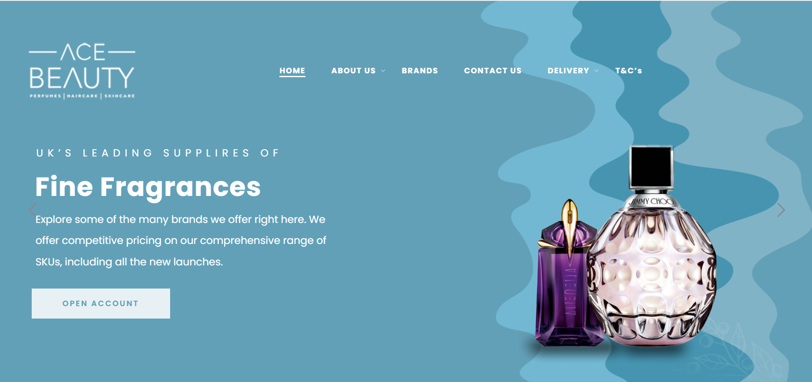
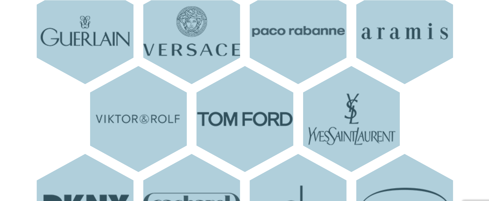

# AceBeauty Shopify Store

This project highlights my Shopify setup and management work for AceBeauty UK — a premium beauty brand.  
I managed the store setup, product catalog organization, and overall store optimization for a better customer shopping experience.

## What I Did
- Customized Shopify theme for brand consistency
- Organized product categories and collections
- Optimized homepage banners and navigation
- Improved mobile and tablet responsiveness
- Enhanced product pages for better conversions

## Technologies Used
- Shopify
- Canva (for banner designs)
- Shopify Apps for SEO & UX enhancement

## Screenshots

## View the Live Store
[AceBeauty UK](https://acebeauty.uk/)
